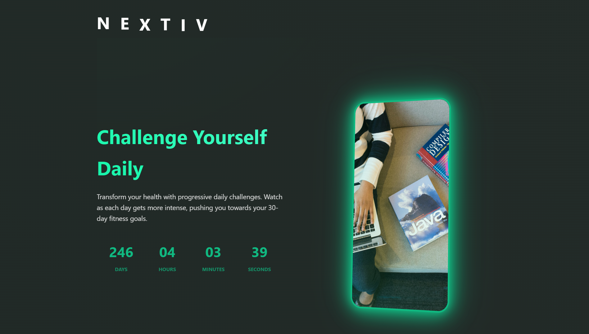

# Nextiv - Your Personal Fitness Journey

Nextiv is a cutting-edge fitness tracking application that transforms your wellness journey into an engaging, gamified experience. With a sleek, modern interface and powerful features, Nextiv helps you achieve your fitness goals while making the process enjoyable and rewarding.

## 🌟 Features

### 📊 Advanced Progress Tracking
- Real-time workout statistics
- Personalized achievement system
- Detailed performance analytics
- Custom milestone tracking

### 🎯 Gamified Fitness Journey
- Interactive challenges
- Daily streaks and rewards
- Achievement unlocks
- Progress visualization

### 💪 Personalized Experience
- Customized workout plans
- Progress-based difficulty adjustment
- Milestone-based progression
- Achievement showcases

### 🔄 Seamless Integration
- Modern, intuitive interface
- Real-time synchronization
- Cross-platform compatibility
- Responsive design

## 🛠️ Built With

- HTML5
- CSS3 (with modern animations and transitions)
- JavaScript (ES6+)
- Mobile-first responsive design
- Custom 3D transformations and effects

## ⚖️ License

**PROPRIETARY SOFTWARE**

This software and its source code are proprietary and confidential. No part of this software may be reproduced, distributed, or transmitted in any form or by any means without the prior written permission of the copyright holder.

All rights reserved. Unauthorized copying, modification, distribution, or use of this software is strictly prohibited.

## 🔨 Development

Built with passion and precision, Nextiv incorporates:
- Modern CSS animations and transitions
- 3D transformations for immersive UI
- Responsive design principles
- Performance-optimized animations
- Custom UI components
- Progressive enhancement

---

© 2025 Nextiv. All Rights Reserved.
